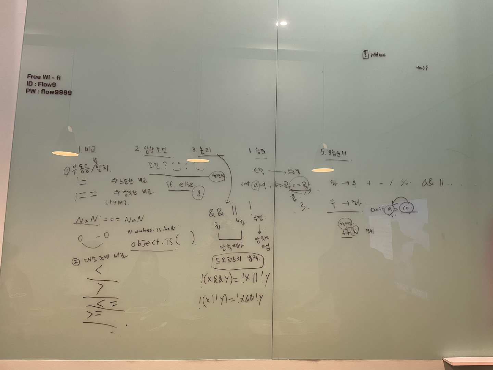

# 07장. 연산자 - 2

> 👩‍ 담당자: 정보연<br/>
> 📝 파트: 비교연산자, 삼항조건연산자, 논리연산자, 쉼표연산자, 연산자 결합순서



### 할당 연산자
- `우항`에 있는 `피연산자`의 **평가 결과**를 `좌항`에 있는 `변수`에 할당
- 부수 효과가 있다.
- 할당문은 표현식이다. > **할당된 값으로 평가**된다.
> 할당문이 표현식이기 때문에 다른 변수에 할당 할 수 있는데, 이를 활용하여 `연쇄 할당`을 할 수 있다. <br/>
```javascript
let a, b, c;
a = b = c = 0;
//a는 0 으로 평가된다.
//b는 0 으로 평가된다.
//c는 0 으로 평가된다.
```

#### 📌 할당 연산자 종류


| 할당 연산자 | 설명                 | 예시     |
|-----------|----------------------|---------|
| =         | 값 할당               | x = 5   |
| +=        | 덧셈 후 할당          | x += 3  |
| -=        | 뺄셈 후 할당          | x -= 3  |
| *=        | 곱셈 후 할당          | x *= 3  |
| /=        | 나눗셈 후 할당        | x /= 3  |
| %=        | 나머지 연산 후 할당   | x %= 3  |
| **=       | 거듭제곱 후 할당       | x **= 3 |
| <<=       | 왼쪽 시프트 후 할당    | x <<= 3 |
| >>=       | 오른쪽 시프트 후 할당  | x >>= 3 |
| >>>=      | 부호 없는 오른쪽 시프트 후 할당 | x >>>= 3 |
| &=        | 비트 AND 후 할당      | x &= 3  |
| \|=       | 비트 OR 후 할당       | x \|= 3 |
| ^=        | 비트 XOR 후 할당      | x ^= 3  |


---
### 비교 연산자
- 좌항과 우항을 비교한 다음 그 결과를 불리언 값으로 반환

#### 📌 동등/일치 비교 연산자
- 둘은 엄격도의 정도가 다르다.
    - `일치` 비교 연산자는 `엄격한 비교` (타입 비교)
    - `동등` 비교 연산자는 `느슨한 비교` (암묵적 타입 변환 비교)
> 동등 비교 연산자는 편리해보이지만, 결과를 예측하기 어렵기 때문에 일치 연산자를 사용하는 것이 좋다.

- 🚫 주의해야 할 점 두가지
    - 양의 0과 음의 0 모두 일치/동등 한다고 해석한다.
    - NaN은 유일하게 자신과 일치하지 않는 값이다. => `Number.isNaN()`을 사용해줘야함
  > ES6에서 도입된 `Object.is 메서드`를 활용하면 정확한 비교 결과를 반환

#### 📌 부동등/불일치 비교 연산자
- 위의 개념과 반대되는 개념
#### 📌 대소 관계 비교 연산자
| 연산자 | 설명                | 예시       |
|---------|---------------------|------------|
| >       | 크다                | x > y      |
| <       | 작다                | x < y      |
| >=      | 크거나 같다         | x >= y     |
| <=      | 작거나 같다         | x <= y     |

---

### 삼항 조건 연산자
- 자바스크립트의 유일한 삼항 연산자
  
- if...else 처럼 사용할 수 있다.
- 차이점은 if...else는 `문`이고, 삼항 조건 연산자는 `표현식`이다.
```javascript
let x = 10;
//불가능
let result = if(x%2) {result = '홀수';} else{result = '짝수';};
//가능
let result = x % 2 ? '홀수' : '짝수';
```
---

### 논리 연산자
- 좌항/우항을 논리 연산한다.
- 부수효과는 없다.
- 반드시 피연산자가 불리언 값이 필요는 없다.
>🔎 피연산자가 불리언 값이 아닐때
>- 논리 부정은 암묵적 타입 변환
>- 논리곱, 논리합은 단축 평가
- 논리 연산자를 간소화한 드 모르간의 법칙을 활용하면 가독성이 좋아진다.
> 🔎 드 모르간의 법칙
!(x || y) === (!x && !y)
!(x && y) === (!x || !y)

| 연산자 | 설명                   | 예시       |
|---------|------------------------|------------|
| &&      | 논리곱 AND             | x && y     |
| \|\|     | 논리합 OR              | x \|\| y   |
| !       | 논리부정 NOT             | !x         |

---

### 쉼표 연산자
- 왼쪽 피연산자부터 차례대로 평가하고 마지막 피연산자의 평가가 끝나면 결과를 반환
- 결국 마지막 피 연산자의 결과를 반환한다.
```javascript
let x, y, z=;

x=1, y=2, z=3; //3
```
---
