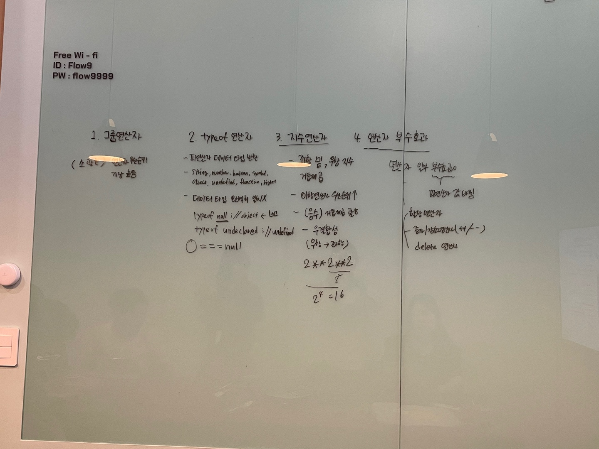

# 07장. 연산자 - 3

> 👩‍ 담당자: 황희정<br/>
> 📝 파트: 그룹 연산자, typeof 연산자, 지수 연산자, 연산자 부수효과 



### 그룹 연산자 ( ‘( 소괄호 )’ ) 
소괄호로 피연산자를 감싸며, 가장 먼저 평가한다. 그룹연산자는 연산자 우선순위가 가장 높다.
그룹 연산자를 사용하면 연산자 우선순위를 조절할 수 있다.

### typeof 연산자 
피연산자의 데이터 타입을 문자열로 반환한다.

- typeof 연산자는 8가지 “string, number, boolean, undefined, symbol, object, function, bigint” 중 하나를 반환한다.
- null을 반환하는 경우는 없다. 함수는 function을 반환함.
- typeof 연산자가 반환하는 문자열은 7개의 데이터 타입과 정확히 일치하지는 않는다.
- 선언하지않은 식별자를 typeof 연산하면 **undefined**를 반환한다. (ReferenceError가 아닌..)

```javascript
typeof null; // object "null이 아닌 object를 반환한다. <-- ***주의 자바스크립트의 첫번째 버그!!!!!!!!!!!!!!!!!!!!****

//null 타입인지 확인할때는 일치 연산자 사용하자
foo === null;

typeof undeclared; // undefined
```

### 지수 연산자 
좌항 피연산자를 밑base으로,  우항의 피연산자를 지수exponent로 거듭 제곱하여 숫자값을 반환한다.

- 음수를 거듭제곱의 밑으로 사용하려면 괄호로 묶어야한다.
- 지수연산자의 결합 순서는 우항에서 좌항이다. (우결합성)
    - 2 ** 3 ** 2; // 512
- 지수연산자와 할당연산자를 결합
    - num **= 2;
- 지수연산자는 이항연산자 중에서 우선순위가 가장 높다.

```javascript
2 ** 0; // 1
2 ** 2; // 4

/* 음수를 거듭제곱의 밑으로 사용하려면 괄호로 묶어야한다. */
(-5) ** 2; // 25

/* Math.pow 메서드로도 가능 */

Math.pow(2, 2); // 4
Math.pow(2, 0); // 1
```

### 연산자 부수효과
- 부수효과가 있는 연산자는 다른 코드에 영향을 준다.
- 부수효과는 피연산자의 값이 바뀐다는 뜻
- `할당 연산자(=), 증가/감소 연산자(++/--), delete 연산자`
